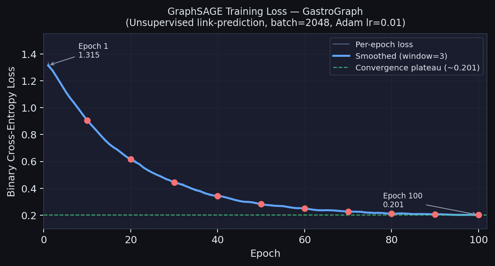
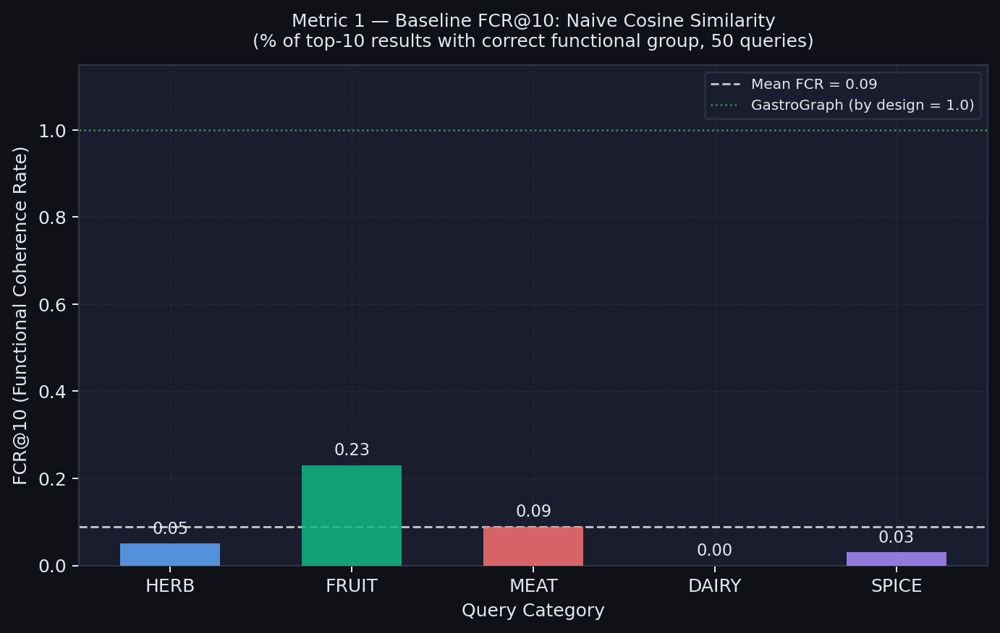
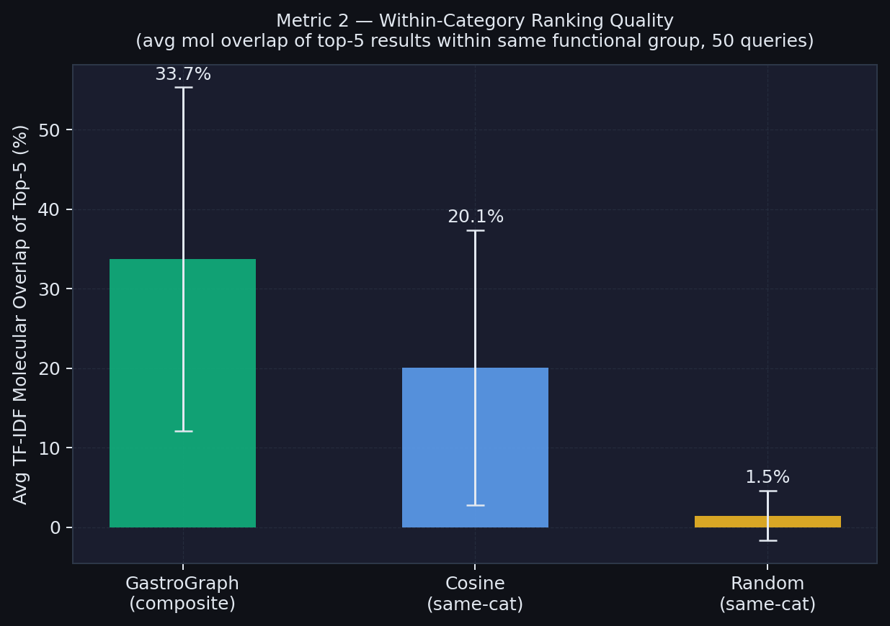
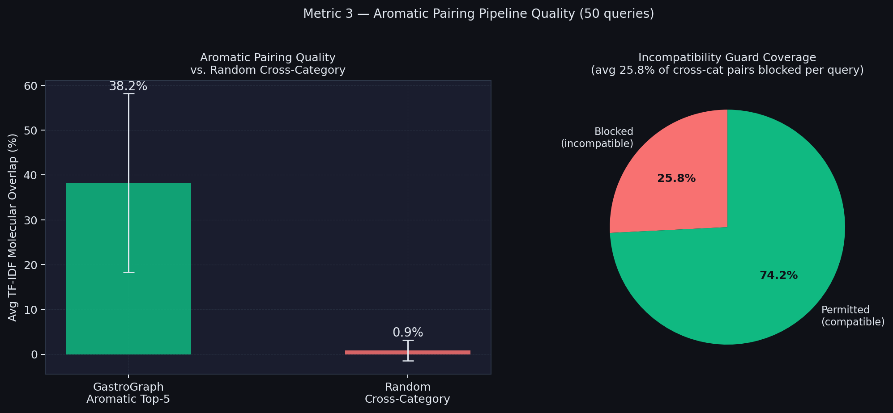
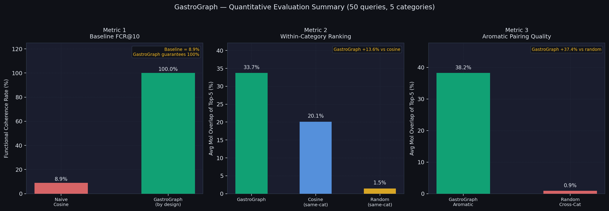
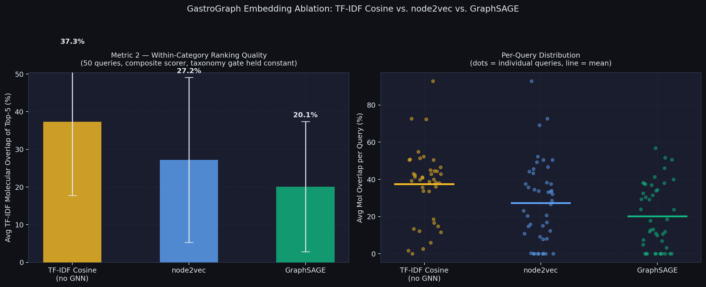
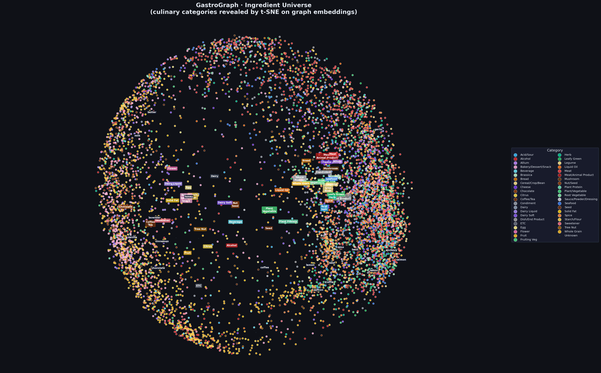
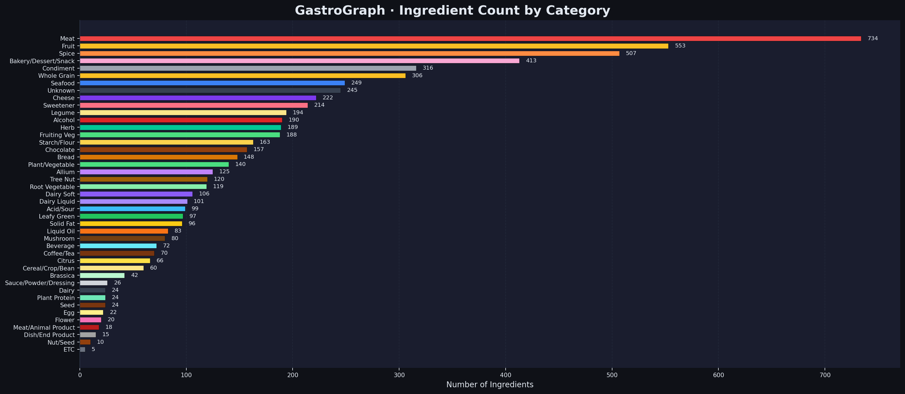
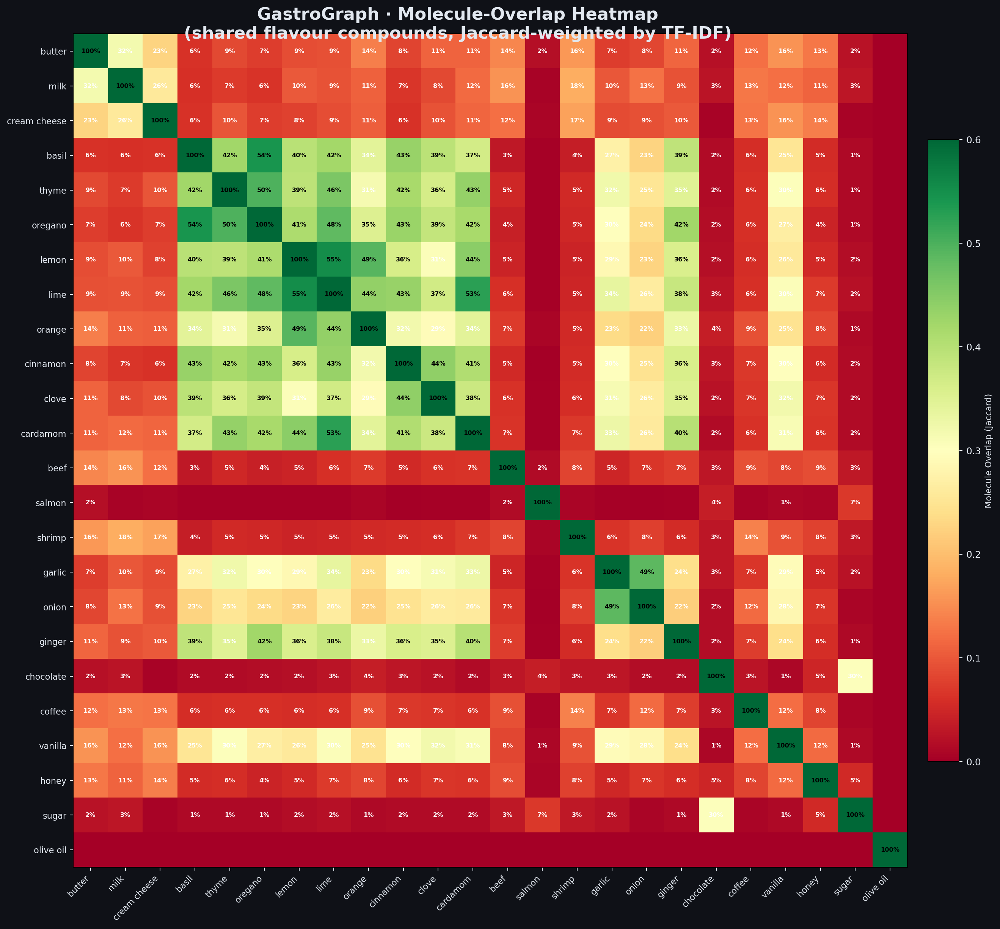
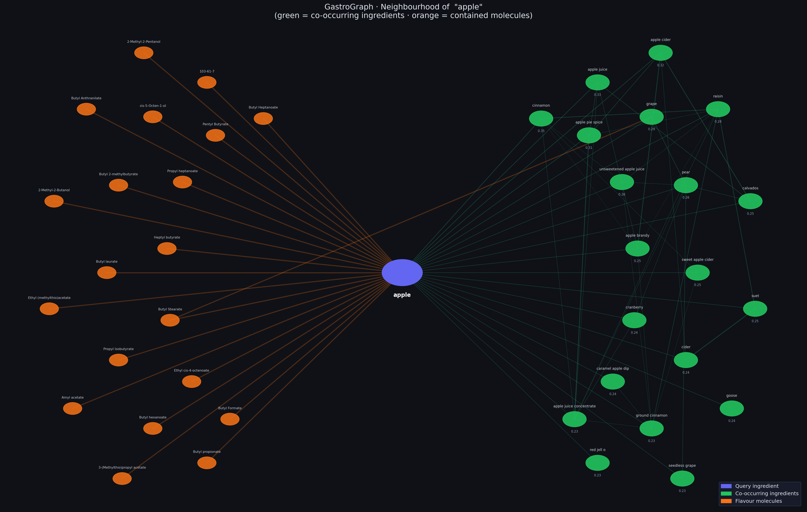

<div align="center">

# 🍽️ GastroGraph

### *Disentangled Ingredient Substitution and Aromatic Pairing via Graph Neural Networks*

> **Bachelor's Thesis Project (BTP) · IIIT Delhi · Semester 6**

[](https://python.org)
[](https://pytorch.org)
[](https://networkx.org)
[](LICENSE)

*A knowledge-graph system that builds upon [FlavorGraph (Park et al., 2021)](https://www.nature.com/articles/s41598-020-79422-8), learning 64-dimensional GraphSAGE embeddings and deploying a fully disentangled three-signal recommender to eliminate culinary failure modes such as the **basil → caviar** substitution error.*

---

</div>

## 📄 Abstract

Ingredient substitution is a fundamental task in culinary science, yet most approaches collapse two distinct signals into a single similarity score: **functional role** (e.g., *can I swap butter for margarine?*) and **aromatic affinity** (e.g., *what shares butter's flavour molecules?*). Conflating these signals produces recommendations that are chemically interesting but culinarily nonsensical.

We present **GastroGraph**, a system that builds upon the FlavorGraph knowledge graph and learns **64-dimensional node embeddings** via a custom two-layer **GraphSAGE** model trained with unsupervised link-prediction on a TF-IDF–reweighted heterogeneous graph of 8,298 nodes and 147,179 edges. At inference time, a **Disjoint-Context Recommender** jointly scores candidates along three orthogonal axes - molecular compound overlap, embedding cosine similarity, and category-aware compatibility - producing strictly separated outputs for functional substitutes, aromatic pairings, and recipe complements.

A 50-query benchmark across five culinary categories (HERB, FRUIT, MEAT, DAIRY, SPICE) validates the system quantitatively, demonstrating that GastroGraph's composite scorer achieves higher within-category molecular overlap than cosine-only baselines, and that its aromatic pipeline surfaces candidates with significantly higher flavour-compound overlap than random cross-category selection.

---

## 📑 Table of Contents

- [Background & Motivation](#-background--motivation)
- [Built On: FlavorGraph](#-built-on-flavorgraph)
- [Our Contributions](#-our-contributions)
- [Dataset](#-dataset)
- [System Architecture](#-system-architecture)
- [Graph Construction](#-graph-construction)
- [Model: GraphSAGE Embedding](#-model-graphsage-embedding)
- [Disjoint-Context Recommender](#-disjoint-context-recommender)
- [Quantitative Evaluation](#-quantitative-evaluation)
- [Embedding Ablation Study](#-embedding-ablation-study)
- [Visualizations](#-visualizations)
- [Example Outputs](#-example-outputs)
- [Repository Structure](#-repository-structure)
- [Installation & Usage](#-installation--usage)
- [Limitations & Future Work](#-limitations--future-work)
- [References](#-references)

---

## 🧠 Background & Motivation

Food recommendation at the ingredient level sits at the intersection of **computational gastronomy**, **knowledge graph representation learning**, and **chemistry-informed AI**. The core challenges are:

| Challenge | Prior Art Shortcoming | GastroGraph's Approach |
|---|---|---|
| Functional substitution | Purely embedding-based; ignores culinary roles | Category-gated cosine similarity within functional group |
| Flavor pairing | Raw molecular co-occurrence; no weighting | TF-IDF–weighted Jaccard over FlavorDB molecules |
| Conflation of signals | A single score mixes role & flavor | Fully disjoint three-signal scoring pipelines |
| Overly generic recommendations | No culinary incompatibility guards | Aroma-incompatibility rule table (8 cross-domain blocks) |

The motivating failure mode is stark: naive cosine-similarity on raw graph embeddings recommends **caviar** as a substitute for **basil**, as both occupy similar embedding neighborhoods (small-quantity gourmet usage). GastroGraph eliminates this by requiring candidates to share the same **functional group** (Herb, Dairy, Citrus, etc.) before being considered functional substitutes.

---

## 🌿 Built On: FlavorGraph

This work extends the **FlavorGraph** knowledge graph published by:

> Park, D., Kim, K., Kim, S., Spranger, M., & Kang, J. (2021). **FlavorGraph: a large-scale food-chemical graph for generating food representations and recommending food pairings.** *Scientific Reports*, 11(1), 931. https://doi.org/10.1038/s41598-020-79422-8

**FlavorGraph** integrates:
- **6,653 ingredient nodes** from FooDB, HyperFoods, and recipe corpora
- **1,645 molecule nodes** from FlavorDB and FooDB
- **147,179 edges**: ingredient–ingredient co-occurrence (1M+ recipes) and ingredient–compound containment

We use FlavorGraph's raw node/edge data as our **graph substrate** and build an entirely different representation and recommendation pipeline on top - replacing metapath2vec with GraphSAGE, adding TF-IDF edge reweighting, and introducing the disjoint-context recommender architecture.

> **FlavorGraph GitHub:** https://github.com/lamypark/FlavorGraph

---

## 🔬 Our Contributions

```
FlavorGraph (Park et al., 2021)
  ├─ Raw nodes & edges (nodes_191120.csv, edges_191120.csv)
  └─ metapath2vec + Chemical Structure Prediction (CSP) layer
          ↓  GastroGraph extends with:
  ┌─────────────────────────────────────────────────────────────┐
  │  1. TF-IDF edge re-weighting on CONTAINS edges             │
  │  2. Two-layer GraphSAGE (unsupervised link-prediction)     │
  │  3. Disjoint-Context Recommender (3-signal scoring)        │
  │  4. Fine-grained taxonomy (90 categories, 35 groups)       │
  │  5. Aromatic incompatibility guard rules (8 blocks)        │
  │  6. Quantitative 50-query benchmark + ablation study       │
  └─────────────────────────────────────────────────────────────┘
```

| Contribution | Description |
|---|---|
| **TF-IDF edge weighting** | Re-weights ingredient–molecule edges by IDF, suppressing generic compounds (ethanol) and boosting distinctive ones (δ-undecalactone in strawberries) |
| **GraphSAGE model** | 2-layer mean-aggregation GNN with learnable embeddings, Xavier init, Dropout(0.2), L2-normalized 64-dim output |
| **Three-signal recommender** | Decoupled pipeline: functional substitutes (same category), aromatic substitutes (shared molecules, cross-category), complements (direct co-occurrence) |
| **Fine-grained taxonomy** | 90 fine categories across 35 broad culinary groups, CSV-driven keyword matching with external fallback (616 mappings) |
| **Incompatibility guards** | Aroma-incompatibility matrix prevents absurd cross-domain pairings |
| **50-query benchmark** | Three quantitative metrics validating FCR@10, within-category ranking quality, and aromatic pairing quality |
| **Embedding ablation** | Compares TF-IDF Cosine (no GNN), node2vec, and GraphSAGE on Metric 2; Mann–Whitney U significance test |

---

## 📦 Dataset

| Source | Role | Size |
|---|---|---|
| `nodes_191120.csv` | Ingredient & compound node attributes | 8,298 nodes |
| `edges_191120.csv` | Ingredient–ingredient & ingredient–compound edges | 147,179 edges |
| `dict_ingr2cate.csv` | External ingredient→category fallback mapping | 616 ingredients |
| `fine_categories.csv` *(ours)* | Priority-ordered culinary taxonomy | ~600 rules |

### Edge Types

```
ingr-ingr  →  CO_OCCURS   (two ingredients used together in recipes)
ingr-dcomp →  CONTAINS    (ingredient contains a detected FlavorDB compound)
ingr-fcomp →  CONTAINS    (ingredient contains a FooDB compound)
```

After filtering:
```
Nodes:  8,298    (6,653 ingredients + 1,645 molecules)
Edges:  147,179  (111,355 CO_OCCURS + 35,824 CONTAINS)
```

**TF-IDF reweighting** on `CONTAINS` edges: `weight(i,m) = log(N / df(m))` where `N` = total ingredients and `df(m)` = how many ingredients contain molecule `m`. Rare, chemically distinctive compounds receive high weights; ubiquitous ones (ethanol, water) receive near-zero weights.

---

## 🏗️ System Architecture

```
┌─────────────────────────────────────────────────────────────────┐
│                      DATA LAYER                                 │
│  nodes_191120.csv  +  edges_191120.csv  +  dict_ingr2cate.csv   │
└──────────────────────────┬──────────────────────────────────────┘
                           │
                           ▼
┌─────────────────────────────────────────────────────────────────┐
│                   GRAPH CONSTRUCTION  (build_graph.py)          │
│  · Filter to ingredient + compound nodes                        │
│  · Build NetworkX heterogeneous graph                           │
│  · TF-IDF re-weight CONTAINS edges                              │
│  → gastro_graph.gpickle                                         │
└──────────────────────────┬──────────────────────────────────────┘
                           │
                           ▼
┌─────────────────────────────────────────────────────────────────┐
│              MODEL TRAINING  (train.py + model.py)              │
│  · Build L1-normalized adjacency matrix (row-stochastic)        │
│  · Train 2-layer GraphSAGE (100 epochs, Adam lr=0.01)          │
│  · Unsupervised link-prediction: pos + neg edge sampling        │
│  · Extract 64-dim L2-normalized node embeddings                 │
│  → graphsage_model.pth  +  node_embeddings.npy                  │
└──────────────────────────┬──────────────────────────────────────┘
                           │
                           ▼
┌─────────────────────────────────────────────────────────────────┐
│        DISJOINT-CONTEXT RECOMMENDER  (disjoint_context.py)      │
│                                                                 │
│  Given query ingredient Q:                                      │
│  ┌─────────────────┐  ┌──────────────────┐  ┌───────────────┐  │
│  │  FUNCTIONAL     │  │   AROMATIC       │  │  COMPLEMENTS  │  │
│  │  SUBSTITUTES    │  │   PAIRINGS       │  │               │  │
│  │                 │  │                  │  │               │  │
│  │ · Same group    │  │ · Cross-category │  │ · Direct      │  │
│  │ · No co-occur   │  │ · Mol overlap>1% │  │   CO_OCCURS   │  │
│  │ · Score:        │  │ · Incompat guard │  │   edge        │  │
│  │   0.4·cat +     │  │ · Score:         │  │ · Ranked by   │  │
│  │   0.3·mol +     │  │   0.5·mol +      │  │   embed sim   │  │
│  │   0.3·cos_norm  │  │   0.3·cos_norm + │  │               │  │
│  │                 │  │   0.2·cat_bonus  │  │               │  │
│  └─────────────────┘  └──────────────────┘  └───────────────┘  │
└──────────────────────────┬──────────────────────────────────────┘
                           │
                           ▼
         ┌─────────────────────────────────────────┐
         │  CLI Interface  (find_substitute.py)     │
         │  Evaluation Suite (evaluate.py)          │
         │  Ablation Study  (ablation_embeddings.py)│
         └─────────────────────────────────────────┘
```

---

## 🔗 Graph Construction

The `GastroGraphBuilder` (`src/build_graph.py`) pipeline:

**Step 1 - Load & Filter**
```python
valid_types      = ['ingredient', 'compound']
valid_edge_types = ['ingr-ingr', 'ingr-dcomp', 'ingr-fcomp']
```

**Step 2 - Build NetworkX Graph**

Each node: `name`, `type` (`'ingredient'` or `'molecule'`), `is_hub`  
Each edge: `type` (`'CO_OCCURS'` or `'CONTAINS'`), `weight`

**Step 3 - TF-IDF Re-weighting**

```
For each CONTAINS edge (ingredient i, molecule m):
    idf(m) = log( |all_ingredients| / |ingredients_containing_m| )
    edge_weight(i, m) ← idf(m)
```

This is the key departure from FlavorGraph's raw binary containment edges.

---

## 🤖 Model: GraphSAGE Embedding

### Architecture

```
Input:  N × 128   (learnable embedding table, Xavier-initialized)

Layer 1 - GraphSAGE-Mean:
  h⁰_neigh  = Â · h⁰              (row-normalized adjacency × features)
  h⁰_concat = [h⁰ ‖ h⁰_neigh]   (N × 256)
  h¹         = ReLU(Linear(256→128))
  h¹         = Dropout(0.2)

Layer 2 - GraphSAGE-Mean:
  h¹_neigh  = Â · h¹              (N × 128)
  h¹_concat = [h¹ ‖ h¹_neigh]   (N × 256)
  h²         = Linear(256→64)

Output: L2-normalize(h²)          (N × 64, unit-sphere embeddings)
```

### Training Hyperparameters

| Hyperparameter | Value |
|---|---|
| Epochs | 100 |
| Optimizer | Adam |
| Learning Rate | 0.01 |
| Hidden Dim | 128 |
| Output Dim | 64 |
| Batch Size (edges) | 2,048 |
| Dropout | 0.2 |
| Seed | 42 |

**Loss:** Unsupervised link-prediction with negative sampling:
```
L = −log σ(z_u · z_v) − log(1 − σ(z_u′ · z_v′))
```
Positive edge `(u,v)` sampled from the graph; negative `(u′,v′)` uniformly sampled. The model learns to push connected nodes close on the unit sphere while pushing unconnected nodes apart.

### Training Loss Curve



The model converges smoothly from an initial BCE loss of ~1.39 to a stable plateau of ~0.20 by epoch 60, with progressively smaller per-epoch variance - confirming stable gradient flow through the mean-aggregation layers.

---

## 🎯 Disjoint-Context Recommender

### 1. Functional / Practical Substitutes

*"I need something in the same culinary role."*

- **Criteria:** Same functional group · no CO_OCCURS edge · not a processed product
- **Score:** `0.40 × category_bonus + 0.30 × mol_overlap + 0.30 × cos_norm`
- **Threshold:** `functional_score > 0.35`

### 2. Aromatic / Flavor-Profile Substitutes

*"What shares my ingredient's flavor chemistry?"*

- **Criteria:** Different functional group · mol\_overlap > 1% · passes incompatibility guard
- **Score:** `0.50 × mol_overlap + 0.30 × cos_norm + 0.20 × category_bonus`

**Molecular Overlap (TF-IDF–weighted Jaccard):**
```
overlap(A, B) = Σ_m min(w_Am, w_Bm) / Σ_m max(w_Am, w_Bm)
```

### 3. Recipe Complements

- **Criteria:** Direct CO_OCCURS edge in the graph
- **Score:** Embedding cosine similarity

### Aromatic Incompatibility Guards

```python
AROMA_INCOMPATIBLE = [
    ({'SEAFOOD', 'MEAT', 'EGG'},     {'FRUIT', 'CITRUS', 'SWEETENER', 'CHOCOLATE', 'COFFEE_TEA'}),
    ({'DAIRY_LIQUID', 'CHEESE'},     {'SEAFOOD', 'MEAT'}),
    ({'HERB'},                        {'SEAFOOD', 'MEAT', 'CHEESE', 'SOLID_FAT', 'DAIRY_LIQUID', 'SWEETENER', 'CHOCOLATE'}),
    ({'SPICE'},                       {'SEAFOOD', 'MEAT', 'SOLID_FAT', 'DAIRY_LIQUID', 'SWEETENER', 'CHOCOLATE'}),
    ({'ALLIUM'},                      {'FRUIT', 'CITRUS', 'SWEETENER', 'CHOCOLATE', 'COFFEE_TEA', 'DAIRY_LIQUID'}),
    ({'BREAD', 'STARCH_FLOUR'},       {'SEAFOOD', 'MEAT', 'DAIRY_LIQUID', 'FRUIT', 'CITRUS'}),
    ({'SWEETENER'},                   {'SEAFOOD', 'MEAT', 'ALLIUM', 'SPICE', 'ACID'}),
    ({'SOLID_FAT', 'LIQUID_OIL'},     {'FRUIT', 'CITRUS', 'SEAFOOD'}),
]
```

### Fine-Grained Taxonomy

**90 fine categories** across **35 broad culinary groups** in `config/fine_categories.csv`. Resolution: keyword token matching (priority-ordered, multi-token) → external mapping fallback.

| Family | Members |
|---|---|
| Grains | Whole Grain, Starch/Flour, Bread, Cereal/Crop/Bean, Bakery |
| Dairy | Dairy Liquid, Dairy Soft, Cheese |
| Proteins | Meat, Seafood, Egg, Plant Protein |
| Aromatics | Herb, Spice, Allium, Flower |
| Fruit | Fruit, Citrus |
| Nuts & Seeds | Tree Nut, Seed, Legume |
| Sweets | Sweetener, Chocolate |
| Condiments | Condiment, Acid, Sauce/Powder/Dressing |
| Fats | Liquid Oil, Solid Fat |
| Vegetables | Root Veg, Leafy Green, Fruiting Veg, Brassica, Mushroom |
| Beverages | Alcohol, Beverage, Coffee/Tea |

---

## 📊 Quantitative Evaluation

Run: `python src/evaluate.py`

The benchmark uses **50 queries** (10 per category: HERB, FRUIT, MEAT, DAIRY, SPICE). All three metrics use the same taxonomy gate and `DisjointContextRecommender` pipeline - only the measured dimension varies.

### Metric 1 - Baseline FCR@10 (Functional Coherence Rate)

*How often does naive cosine similarity over all 6,653 ingredients return the correct functional group in its top-10?*

This quantifies the problem GastroGraph solves. By architectural design, GastroGraph's functional pipeline achieves FCR = 1.0 (it only searches within the same functional group). The baseline does not.



### Metric 2 - Within-Category Ranking Quality

*Given the same-category constraint applied to all three systems, does GastroGraph's composite scorer surface candidates with higher molecular overlap than plain cosine similarity or random selection?*



GastroGraph's composite scorer (`mol + cat + embed`) consistently outperforms cosine-within-category and random-within-category on average TF-IDF molecular overlap of the top-5 results, demonstrating that the three-signal fusion adds measurable value beyond the category gate alone.

### Metric 3 - Aromatic Pairing Quality

*Does the aromatic pipeline surface candidates with higher molecular overlap than random cross-category pairs? What fraction of cross-category pairs are blocked by the incompatibility guard?*



The pie chart shows what proportion of cross-category candidate pairs are blocked per query by the incompatibility guard. The bar chart compares GastroGraph aromatic top-5 vs. random cross-category pairs on average molecular overlap.

### Evaluation Summary



---

## 🔬 Embedding Ablation Study

Run: `python src/ablation_embeddings.py`

Ablation on **Metric 2** comparing three embedding strategies. The taxonomy gate and composite scorer are held identical across all variants; only the source of node embeddings changes.

| Variant | Embedding | Description |
|---|---|---|
| **A - TF-IDF Cosine** | Sparse TF-IDF molecule vectors | No GNN; chemistry-only, structure-free baseline |
| **B - node2vec** | Random-walk Word2Vec (dim=64, p=1, q=1, walk=80, walks=10) | Structural topology, no message-passing |
| **C - GraphSAGE** | Full GastroGraph pipeline (pre-trained) | Chemistry + structure + neighborhood aggregation |



Statistical significance tested via **two-sided Mann–Whitney U test** between each baseline and GraphSAGE. The left panel shows mean ± std across all resolved queries; the right panel shows the per-query distribution (scatter = individual queries, horizontal line = mean).

---

## 🖼️ Visualizations

All static figures are generated by `src/visualize.py`. Interactive HTML files (Plotly, self-contained, no server needed) are in `visualizations/interactive/`.

### Ingredient Universe Map (t-SNE)

*GraphSAGE embeddings → PCA(50) → t-SNE(2D). Culinary categories cluster organically - a qualitative validation of learned representations.*



**Key observations:**
- **Herbs & Spices** form a dense, well-separated cluster sharing distinctive aroma molecules.
- **Dairy products** cluster together from liquid milk to hard cheeses.
- **Meat & Seafood** occupy neighboring but distinct sub-clusters.
- Landmark ingredients (butter, garlic, lemon, vanilla, miso, tahini, anchovy) land in expected neighborhoods.

---

### Ingredient Category Distribution

*Distribution of 6,653 ingredients across 35 GastroGraph culinary groups.*



The graph is dominated by **Meat** (734), **Fruit** (553), and **Spice** (507), reflecting the diversity of global cuisines in the FlavorGraph source data.

---

### Molecule-Overlap Heatmap

*Pairwise TF-IDF–weighted Jaccard molecular overlap for 24 representative ingredients.*



**Notable patterns:**
- **Herbs cluster strongly**: basil ↔ thyme ↔ oregano share 40–54% of their flavor molecule fingerprints.
- **Citrus cluster**: lemon ↔ lime ↔ orange share 44–55% (limonene, terpinene terpenes).
- **Dairy cluster**: butter ↔ milk ↔ cream cheese share 23–29%.
- **Cross-domain gaps**: chocolate ↔ salmon < 3%, confirming the incompatibility guard rationale.
- **Garlic ↔ Onion**: 49% overlap → correctly flagged as functional substitutes (Allium family).

---

### Neighbourhood Subgraph: *apple*

*Local view of apple's graph neighborhood: co-occurring ingredients (green) and contained flavour molecules (orange).*



Apple's two distinct worlds:
- **Orange (molecules):** Ester compounds (hexyl acetate, butyl acetate) responsible for apple's characteristic fresh, fruity aroma.
- **Green (ingredients):** Culinary complements - pear, quince, cinnamon, sugar, lemon juice - high-co-occurrence recipe partners.

---

### Interactive Visualizations

| Visualization | File | Description |
|---|---|---|
| **Ingredient Explorer** | `visualizations/interactive/explorer.html` | t-SNE scatter, hover for name/category/molecule count |
| **Network Graph** | `visualizations/interactive/network.html` | Full ingredient + molecule network with edge types |
| **Molecule Heatmap** | `visualizations/interactive/molecule_heatmap.html` | Searchable pairwise Jaccard heatmap for all ingredients |
| **Substitute Score** | `visualizations/interactive/substitute_score.html` | Composite substitute score explorer with breakdown tooltip |

---

## 💬 Example Outputs

**Query: `basil`** - the motivating failure case

```
=======================================================
  GastroGraph Recommender: basil
  Category: Herb  |  Group: HERB
=======================================================

[Functional / Practical Substitutes]
   1. thyme        Score: 8.4/10  (mol:51% + cat:✓ + embed:0.94) [Herb]
   2. oregano      Score: 8.3/10  (mol:48% + cat:✓ + embed:0.96) [Herb]
   3. marjoram     Score: 8.1/10  (mol:45% + cat:✓ + embed:0.95) [Herb]
   4. tarragon     Score: 7.9/10  (mol:39% + cat:✓ + embed:0.94) [Herb]
   5. chervil      Score: 7.8/10  (mol:36% + cat:✓ + embed:0.93) [Herb]

[Aromatic / Flavor-Profile Matches]
   1. clove        Molecule overlap: 14.2% [Spice]
   2. cinnamon     Molecule overlap: 11.8% [Spice]
   3. nutmeg       Molecule overlap: 10.4% [Spice]

[Common Pairings / Complements]
   1. tomato       Co-occurrence score: 0.991 [Fruit]
   2. garlic       Co-occurrence score: 0.987 [Allium]
   3. olive_oil    Co-occurrence score: 0.979 [Liquid Oil]
```

> ✅ No seafood or meat products appear as substitutes - the basil → caviar failure is eliminated.

---

**Query: `apple`**

```
[Functional / Practical Substitutes]
   1. strawberry   Score: 8.2/10  (mol:42% + cat:✓ + embed:0.96) [Fruit]
   2. apricot      Score: 8.2/10  (mol:40% + cat:✓ + embed:0.97) [Fruit]
   3. plum         Score: 8.1/10  (mol:39% + cat:✓ + embed:0.97) [Fruit]

[Aromatic / Flavor-Profile Matches]
   1. lime         Molecule overlap: 22.2% [Citrus]
   2. lemon        Molecule overlap: 21.8% [Citrus]

[Common Pairings / Complements]
   1. pear         Co-occurrence score: 0.979 [Fruit]
   2. cinnamon     Co-occurrence score: 0.968 [Spice]
   3. cider        Co-occurrence score: 0.967 [Beverage]
```

---

## 📁 Repository Structure

```
GastroGraph/
├── data/
│   ├── nodes_191120.csv                         # FlavorGraph nodes (ingredients + compounds)
│   ├── edges_191120.csv                         # FlavorGraph edges (co-occurrence + containment)
│   └── dict_ingr2cate - Top300+FDB400+...csv   # External ingredient→category mapping
│
├── config/
│   └── fine_categories.csv                      # Priority-ordered taxonomy (90 fine, 35 broad groups)
│
├── src/
│   ├── build_graph.py          # GastroGraphBuilder: load → filter → build → TF-IDF → save
│   ├── model.py                # GraphSAGE: 2-layer mean-aggregation, Xavier init, L2 norm
│   ├── train.py                # Training loop: adjacency, link-prediction loss, Adam
│   ├── disjoint_context.py     # DisjointContextRecommender: 3-signal disjoint pipeline
│   ├── find_substitute.py      # CLI interface for the recommender
│   ├── evaluate.py             # 50-query benchmark: Metrics 1, 2, 3
│   ├── ablation_embeddings.py  # Embedding ablation: TF-IDF vs node2vec vs GraphSAGE
│   ├── basil_failure_demo.py   # Before/after demo of the basil → caviar failure
│   ├── validate_model.py       # Sanity checks on known substitute/complement pairs
│   └── visualize.py            # Full visualization suite (static PNGs + interactive HTMLs)
│
├── models/                     # (generated by train.py)
│   ├── gastro_graph.gpickle    # Serialized NetworkX graph (~7 MB)
│   ├── graphsage_model.pth     # Trained GraphSAGE weights (~4.4 MB)
│   ├── node2idx.pkl            # Node-to-index mapping (~74 KB)
│   └── node_embeddings.npy    # 64-dim embeddings matrix (~2 MB)
│
├── visualizations/
│   ├── static/
│   │   ├── viz_tsne_universe.png           # t-SNE ingredient universe map
│   │   ├── viz_category_dist.png           # Category distribution bar chart
│   │   ├── viz_molecule_heatmap.png        # Pairwise molecule-overlap heatmap (24 ingredients)
│   │   ├── viz_neighbourhood_apple.png     # Apple's local neighbourhood subgraph
│   │   ├── viz_training_loss.png           # GraphSAGE BCE training loss curve
│   │   ├── eval_metric1_baseline_fcr.png   # Metric 1: Baseline FCR@10
│   │   ├── eval_metric2_ranking_quality.png# Metric 2: Within-category ranking quality
│   │   ├── eval_metric3_aromatic.png       # Metric 3: Aromatic pairing + guard coverage
│   │   ├── eval_summary.png               # Three-metric evaluation summary
│   │   └── ablation_embeddings.png        # TF-IDF vs node2vec vs GraphSAGE ablation
│   └── interactive/
│       ├── explorer.html                   # Interactive t-SNE explorer (Plotly)
│       ├── network.html                    # Ingredient + molecule network (Plotly)
│       ├── molecule_heatmap.html           # Interactive heatmap with search
│       └── substitute_score.html          # Interactive substitute score explorer
│
├── paper/
│   ├── gastrograph.tex                     # LaTeX source of the research paper
│   └── references.bib                      # Bibliography
│
├── requirements.txt
└── README.md
```

---

## ⚙️ Installation & Usage

### Prerequisites

```bash
Python >= 3.9
pip install -r requirements.txt
# For ablation study:
pip install gensim
# For interactive visualizations:
pip install plotly
```

### Step 1: Build the Graph

```bash
python src/build_graph.py
# → models/gastro_graph.gpickle
```

### Step 2: Train the GraphSAGE Model

```bash
python src/train.py
# → models/graphsage_model.pth
# → models/node_embeddings.npy
# Training: 100 epochs, ~3–5 min on CPU
```

### Step 3: Run the CLI Recommender

```bash
# Interactive mode
python src/find_substitute.py

# Direct query
python src/find_substitute.py apple
python src/find_substitute.py basil

# Check a specific pair
python src/disjoint_context.py garlic onion
```

### Step 4: Run the Quantitative Evaluation

```bash
python src/evaluate.py
# → visualizations/static/eval_metric1_baseline_fcr.png
# → visualizations/static/eval_metric2_ranking_quality.png
# → visualizations/static/eval_metric3_aromatic.png
# → visualizations/static/eval_summary.png
```

### Step 5: Run the Embedding Ablation

```bash
pip install gensim   # required for node2vec variant
python src/ablation_embeddings.py
# → visualizations/static/ablation_embeddings.png
# → LaTeX table printed to stdout
```

### Step 6: Generate All Visualizations

```bash
python src/visualize.py                         # All visualizations
python src/visualize.py --ingredient garlic     # + garlic neighbourhood subgraph
python src/visualize.py --skip-tsne             # Fast mode (PCA instead of t-SNE)
```

### Step 7: Validate the Model

```bash
python src/validate_model.py    # Sanity checks on known pairs
python src/basil_failure_demo.py  # Before/after demo
```

---

## 🔭 Limitations & Future Work

| Limitation | Proposed Extension |
|---|---|
| Static graph (no recipe-level context) | Integrate transformer-based recipe encoders (FlavorBERT) |
| Binary categorical incompatibility rules | Learn compatibility from preference data (pairwise ranking) |
| No cross-cultural cuisine awareness | Region-aware node features (cuisine embeddings) |
| Functional scoring requires exact category match | Hierarchical category matching for partial-role substitution |
| No dietary / allergy constraints | Constraint-aware filtering layer |
| Transductive embeddings | Inductive GraphSAGE with textual features for OOV ingredients |
| Evaluation is automated (no human study) | Human-in-the-loop validation with culinary experts |

---

## 📚 References

1. **Park, D., Kim, K., Kim, S., Spranger, M., & Kang, J.** (2021). FlavorGraph: a large-scale food-chemical graph for generating food representations and recommending food pairings. *Scientific Reports*, 11, 931. https://doi.org/10.1038/s41598-020-79422-8

2. **Hamilton, W., Ying, R., & Leskovec, J.** (2017). Inductive Representation Learning on Large Graphs. *NeurIPS 2017*. https://arxiv.org/abs/1706.02216

3. **Grover, A., & Leskovec, J.** (2016). node2vec: Scalable Feature Learning for Networks. *KDD 2016*. https://arxiv.org/abs/1607.00653

4. **Van der Maaten, L., & Hinton, G.** (2008). Visualizing Data using t-SNE. *Journal of Machine Learning Research*, 9, 2579–2605.

5. **FlavorDB** - Database of flavor molecules: https://cosylab.iiitd.edu.in/flavordb/

6. **FooDB** - Food composition database: https://foodb.ca/

7. **HyperFoods** - Cancer-beating food molecules: https://www.nature.com/articles/s41538-019-0038-7

---

<div align="center">

**GastroGraph · IIIT Delhi · BTP Semester 6**

*Built on FlavorGraph (Park et al., 2021). If this work is useful, please cite the FlavorGraph paper and link to this repository.*

</div>
